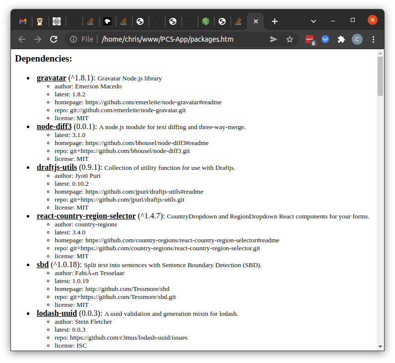
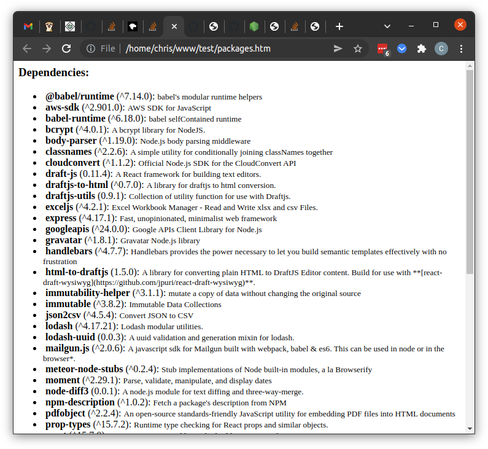

# npmPackageLookup
Reads a package.json and generates an html doc with details on all packages from NPM.  
Its made to be as simple as possible - uses only native node functions.

# Usage 
Add this file to your directory and run it with `node package_lookup.js`.  It will generate packages.htm  
  
Or you could run it as s tool from anywhere by passing it a path to a packages.json:
`node package_lookup.js c:\path\to\packages.json` .  
You can specify the filename or just give it the directory.
The packages.htm file will be generated in the same directory as packages.json, overwriting whatever is there.

It can also output a minimal html format with just name, version, and package by passing 'false' as the second argument.
`node package_lookup.js c:\path\to\packages.json false` 
(extra data will still be present as data tags and tootip title)

# Example output

